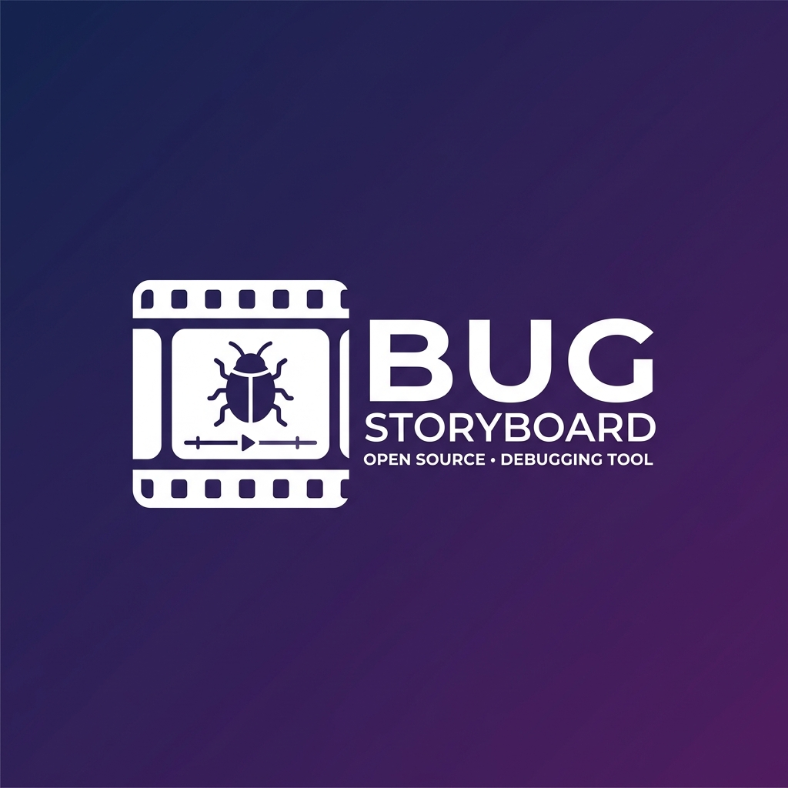

# 🐛 Bug Storyboard

**Record. Rewind. Debug.**



An open-source frontend debugging tool that records a short timeline of state changes, user actions, and errors before you hit a bug — so you can see what actually changed instead of guessing with `console.log`.

## ✨ Features

- **🎯 State Tracking** — Wrap React state with `useTrackedState` and watch changes flow into your timeline
- **🖱️ Action Recording** — Track button clicks and custom events with `trackAction`
- **💥 Error Capture** — Automatic global error and unhandled rejection tracking
- **📁 Local Storage** — Bug Stories saved as JSON files via a lightweight Node collector
- **⏱️ Timeline Viewer** — Visual React app to inspect events, state diffs, and error stacks
- **🔧 Drop-in SDK** — Single `initBugStoryboard()` call to get started

## 🚀 Quick Start

### 1. Install

**From GitHub (until npm packages are published):**

```bash
# Install the monorepo
git clone https://github.com/build-neurall/bug-storyboard.git
cd bug-storyboard
pnpm install

# Or install packages directly from GitHub
npm install github:build-neurall/bug-storyboard#master
```

> **Note:** npm packages (`@neurall/bug-storyboard-sdk`, etc.) will be published soon. For now, use the GitHub installation method.

### 2. Start the Collector

```bash
cd packages/collector
pnpm dev
# Collector running on http://localhost:5777
```

### 3. Start the Viewer

```bash
cd packages/viewer
pnpm dev
# Viewer running on http://localhost:3000
```

### 4. Add SDK to Your React App

```tsx
import { initBugStoryboard } from "@neurall/bug-storyboard-sdk";

initBugStoryboard({
  appId: "my-app",
  collectorUrl: "http://localhost:5777"
});

function Cart() {
  const [items, setItems] = useTrackedState("cart.items", []);
  const [count, setCount] = useTrackedState("cart.count", 0);

  return (
    <div>
      <button onClick={() => {
        trackAction("add-to-cart", { from: "product-page" });
        setItems([...items, "New Item"]);
        setCount(count + 1);
      }}>
        Add to Cart
      </button>

      <button onClick={() => captureBug("cart-state-bug")}>
        Capture Bug Story
      </button>
    </div>
  );
}
```

## 📐 Architecture

```
bug-storyboard/
├── packages/
│   ├── shared/       # Shared TypeScript types & interfaces
│   ├── sdk/          # React SDK (useTrackedState, trackAction, captureBug)
│   ├── collector/    # Node.js server — stores Bug Stories as JSON
│   └── viewer/       # React + Vite app — timeline visualization
└── .bug-storyboard/
    └── stories/      # Bug Story JSON files
```

### SDK

The SDK runs inside your React app. It maintains an in-memory event buffer (default: 30s window) and sends Bug Stories to the collector on demand.

### Collector

A lightweight Express/Fastify server that:
- `POST /stories` — Save a Bug Story
- `GET /stories` — List all stories
- `GET /stories/:id` — Get full story

Runs on port `5777` by default.

### Viewer

A React + Vite app with two views:
- **`/`** — Story list with timestamps and event counts
- **`/story/:id`** — Timeline view with event details and state diffs

## 🎨 API Reference

### `initBugStoryboard(config?)`

Initialize the SDK. Call once at app root.

```ts
interface InitConfig {
  appId?: string;           // default: "unknown"
  bufferDurationMs?: number; // default: 30000 (30s)
  collectorUrl?: string;    // default: "http://localhost:5777"
}
```

### `useTrackedState<T>(label, initial)`

React hook that wraps `useState`. Records every state change.

```tsx
const [value, setValue] = useTrackedState("counter", 0);
```

### `trackAction(label, meta?)`

Record a user action event.

```ts
trackAction("button-click", { variant: "primary" });
```

### `captureBug(label, meta?)`

Send the current event buffer to the collector as a Bug Story.

```ts
await captureBug("checkout-flow-broken", { userId: 123 });
```

## 📦 Packages

| Package | Version | Description |
|--------|---------|-------------|
| `@neurall/bug-storyboard-sdk` | `0.1.0` | React SDK |
| `@neurall/bug-storyboard-collector` | `0.1.0` | Node collector server |
| `@neurall/bug-storyboard-viewer` | `0.1.0` | Timeline viewer app |
| `@neurall/bug-storyboard-shared` | `0.1.0` | Shared types |

## 🤝 Contributing

Contributions welcome! Please read `CONTRIBUTING.md` for setup instructions and coding standards.

## 📄 License

MIT License — see `LICENSE` file for details.

---

Built with 🪶 by [build-neurall](https://github.com/build-neurall)
